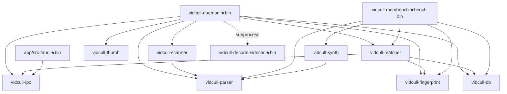

# ARCHITECTURE

vidcull는 **로컬 단일 사용자 영상 중복 정리 도구**다. 무거운 작업(스캔·파싱·지문·매칭)은
백그라운드 데몬 프로세스가 수행하고, Tauri 데스크톱 UI는 IPC로 그 결과를 소비한다.
이 문서는 크레이트 의존 그래프와 프로세스 경계를 기록한다.

## 프로세스 경계

```
┌─────────────────────────────┐      named pipe / UDS      ┌──────────────────┐
│ app (Tauri 데스크톱)         │ ◄────── vidcull-ipc v-gate ────► │ vidcull-daemon        │
│  WebView(Svelte) ↔ src-tauri │                            │  스캔→파싱→지문   │
│  invokeSafe 런타임 검증       │                            │  →매칭→썸네일     │
└─────────────────────────────┘                            │  SQLite(vidcull-db)   │
                                                           └──────────────────┘
```

- **UI ↔ 데몬**은 별도 프로세스. `vidcull-ipc`가 프로토콜(현재 v11)과 transport(Windows named
  pipe / Unix domain socket)를 소유하며, 버전 불일치는 하드 게이트로 거부한다.
- 프론트 TS는 IPC 응답을 `app/src/lib/ipc/validate.ts`에서 런타임 검증한다 — `as` 단언
  금지.
- 데몬은 안정적 데이터·에러 코드만 전송하고, 사용자 대면 문자열은 UI가 단일 출처로
  소유하는 방향이다.

## 크레이트 의존 그래프

화살표는 `A → B` = "A가 B에 의존". `vidcull-core`는 전 크레이트가 의존하므로 생략.
점선 `-.->`는 cargo 의존이 아니라 런타임 **자식 프로세스 spawn**이다(decode-sidecar).



## 크레이트 책임

| 크레이트                 | 종류                         | 책임                                                                                                                                                                                                                                             |
| ------------------------ | ---------------------------- | ------------------------------------------------------------------------------------------------------------------------------------------------------------------------------------------------------------------------------------------------ |
| `vidcull-core`           | lib                          | 공통 타입·에러·기본 추상화 (전 크레이트의 토대)                                                                                                                                                                                                  |
| `vidcull-parser`         | lib                          | 이중 경로 파싱 — 네이티브 MP4/MKV 고속 경로 + ffmpeg CLI 폴백, 네이티브 intra 디코더(B15/N5·N7)                                                                                                                                                  |
| `vidcull-scanner`        | lib                          | 파일시스템 walk·변경 감지·메타데이터 수집·워처                                                                                                                                                                                                   |
| `vidcull-fingerprint`    | lib                          | 다계층 압축 영상 지문 생성 (Tier 1 전역 + Tier 2 시간축)                                                                                                                                                                                         |
| `vidcull-matcher`        | lib                          | 중복 검출(LSH)·부분 클립 정렬(AnchorIndex)·랭킹·신뢰 점수                                                                                                                                                                                        |
| `vidcull-db`             | lib                          | SQLite(WAL) 영속층 — 파일·지문·작업 큐 repository, 스냅샷 백업/삭제 저널                                                                                                                                                                         |
| `vidcull-thumb`          | lib                          | 썸네일 인코딩 + 디스크 캐시                                                                                                                                                                                                                      |
| `vidcull-ipc`            | lib                          | 데몬 ↔ UI IPC 프로토콜 + transport, 버전 하드 게이트                                                                                                                                                                                             |
| `vidcull-daemon`         | **bin**                      | 백그라운드 인덱싱 데몬 — 파이프라인 오케스트레이션, 스로틀링, 롤링 로그/panic hook                                                                                                                                                               |
| `vidcull-membench`       | bin                          | 측정 하니스 — 그룹핑 피크 메모리·풀 리빌드 비용·sparse-decode 타이밍 (Phase 11.3)                                                                                                                                                                |
| `vidcull-synth`          | lib                          | 결정적 합성 영상 코퍼스 생성기(ffmpeg 구동) — 회귀·recall 테스트용                                                                                                                                                                               |
| `app/src-tauri`          | **bin**                      | Tauri 데스크톱 — WebView(Svelte 5) 호스팅, vidcull-ipc로 데몬과 통신                                                                                                                                                                             |
| `vidcull-decode-sidecar` | **bin** (workspace-excluded) | in-process libav 디코드 사이드카 — 데몬이 자식 프로세스로 spawn, LGPL libav DLL을 동적 링크해 per-frame `ffmpeg` spawn 없이 폴백 디코드. LGPL 링크(`FFMPEG_DIR`+libclang 필요)라 워크스페이스 `exclude`(별도 빌드), 출고 시 externalBin으로 번들 |

## 설계 불변식 (요약)

- **결정성(§J)**: 지문 파이프라인은 핀된 ffmpeg(vendored, SHA-256 검증)와 정준 2.5s 디코드
  그리드 위에서 시드 동일 → 바이트 동일을 보장한다.
- **안전성**: 크레이트별 `unsafe_code = "forbid"`(또는 deny) 기조; 불가피한 OS FFI(예:
  `vidcull-daemon/src/metrics.rs`)는 국소 `#[allow(unsafe_code)]` + `SAFETY:` 주석으로 격리.
- **삭제 안전**: 실파일 삭제는 OS 휴지통 경유 + DB soft-delete + 저널/undo.
- **메타 예산**: 영상당 DB 메타데이터 ≤ 20KB.
- **네이티브 디코더 게이트 = 지문 동일성(bit-exact 아님)**: 네이티브 intra 디코더의
  회귀 게이트는 `phash(네이티브 프레임) == phash(ffmpeg 골든 프레임)`이다. 제품
  목표(중복 탐지)와 일치하며, 지문이 갈리는 케이스만 버그로 간주한다. 픽셀 단위 미세 차이
  (predictor 라운딩 등)는 wontfix. CABAC desync는 프레임을 충분히 흔들어 지문을 깨므로
  엔트로피 계층 정합성은 자동 검출된다.
- **네이티브 HEVC 수용 범위**: `transform_skip`(§8.6.4.2)·`cu_qp_delta`
  (적응 per-CU QP, §8.6.1)를 네이티브가 지원한다. x265 기본이 둘 다 켜므로 이전엔 실
  HEVC 대부분이 느린 ffmpeg 폴백이었으나, 이제 네이티브(2~4×)가 수용한다. recon 바이트
  정확 픽스처(각 기능 단독+결합)와 실코퍼스 Native 라우팅으로 검증.
- **영구 fallback 범위(재논의 금지)**: AV1·VP9·10-bit·tiles·transquant-bypass·PCM은
  네이티브 디코더 대상이 아니며 항상 ffmpeg 폴백으로 처리한다.
