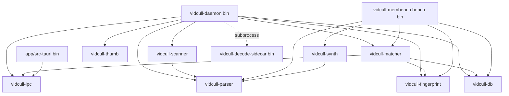

# CLAUDE.md

This file provides guidance to Claude Code (claude.ai/code) when working with code in this repository.

## 먼저 읽을 문서 (지도)

이 저장소에는 이미 AI 코딩 도구 전체(Claude Code 포함)에 적용되는 규칙 문서가 있다. **`AGENTS.md`가 작업 규칙의 기준 문서**이므로, 코드를 고치기 전에 반드시 먼저 읽는다. 아래는 그 문서가 가리키는 세부 지도다:

- [AGENTS.md](AGENTS.md) — 작업 규칙 전체(불변식 준수, 병렬/순차 조사 원칙, 커밋 전 자체 재검토, 답변/주석 한국어 작성 등). **이 문서와 충돌하는 지시가 없는 한 그대로 따른다.**
- [docs/invariants.md](docs/invariants.md) — 절대 깨면 안 되는 규칙(지문 결정성, panic 격리, 삭제 안전, IPC 버전 게이트, 메타 예산, unsafe_code 기조, 네이티브 디코더 수용 범위)
- [docs/commands.md](docs/commands.md) — 빌드·테스트·검증 명령 전체 목록
- [docs/conventions.md](docs/conventions.md) — Rust/TypeScript 코드 관례
- [docs/db-schema.md](docs/db-schema.md) — SQLite 스키마 누적 스냅샷(v001–v017)
- [docs/tech-debt.md](docs/tech-debt.md) — 알려진 성능 개선 후보(파일:라인 단위)
- [ARCHITECTURE.md](ARCHITECTURE.md) — 크레이트 의존 그래프·프로세스 경계
- [README.md](README.md) — 프로젝트 소개·설치·사용법

이 문서와 위 문서들의 내용이 어긋나면 위 문서들이 기준이다. 라이선스는 **PolyForm Noncommercial 1.0.0** — 상업적 활용을 전제로 한 제안은 만들지 않는다.

## 자주 쓰는 명령

| 목적 | 명령 |
| --- | --- |
| Rust 정적 확인 | `cargo check --workspace` |
| Rust 전체 테스트 | `cargo test --workspace` |
| 특정 크레이트만 테스트 | `cargo test -p <crate-name>` (예: `vidcull-fingerprint`, `vidcull-matcher`) |
| 특정 테스트 함수만 | `cargo test -p <crate-name> <test_name>` |
| Rust lint/format | `cargo fmt`, `cargo clippy --workspace --all-targets` |
| 벤치마크 | `cargo bench -p vidcull-fingerprint --bench fingerprint` — 성능 주장은 반드시 이 결과로 근거를 댄다 |
| 프론트 타입 체크 | `cd app && npm run check` |
| 프론트 유닛 테스트 (전체) | `cd app && npm test` |
| 프론트 유닛 테스트 (단일 파일) | `cd app && npx vitest run <path>` |
| 프론트 E2E(Playwright) | `cd app && npm run e2e` (최초 1회 `npx playwright install chromium` 필요) |
| 개발 모드 실행 | `cd app && npm run tauri dev` |
| 데몬만 단독 실행 | `cargo run -p vidcull-daemon` |
| 인스톨러 전체 빌드 | 저장소 루트 `build-installer.bat` 실행 — daemon 스테이징 → ffmpeg/디코드 사이드카 스테이징 → `npm run tauri build` 순서, 결과물은 `app/src-tauri/target/release/bundle/nsis/vidcull_<version>_x64-setup.exe` |

- UI 변경은 타입체크·유닛테스트 통과만으로 "동작함"을 주장하지 않는다 — `npm run tauri dev`나 `app/scripts/verify-*.mjs`로 직접 확인한다.
- 지문·해시 계산 경로를 건드렸다면 golden bit 테스트(`golden_*_to_bits`, `simd_*_is_bit_identical_to_scalar_reference`) 통과가 최소 검증 조건이다.
- 버전을 올릴 때는 4개 파일을 함께 수정한다: 루트 `Cargo.toml`(`workspace.package.version`), `app/src-tauri/Cargo.toml`, `app/package.json`, `app/src-tauri/tauri.conf.json`.
- `rustfmt.toml`(edition 2024, max_width 100, 4-space), `clippy.toml`(msrv 1.85), `.editorconfig`를 그대로 따른다.

## 아키텍처 개요

vidcull은 로컬 대용량 영상 라이브러리에서 중복 영상(완전 동일 / 재인코딩 / 크기·크롭·워터마크 변형 / 부분 클립)을 찾는 개인용 Windows·Linux 데스크톱 도구다. 백엔드(Rust 워크스페이스)와 프론트(Tauri 2 + SvelteKit)는 로컬 IPC로만 통신하는 **별도 프로세스**다.

```
┌─────────────────────────────┐      named pipe / UDS      ┌──────────────────────┐
│ app (Tauri 데스크톱)         │ ◄────── vidcull-ipc v-gate ──► │ vidcull-daemon        │
│  WebView(Svelte 5) ↔ src-tauri │                          │  스캔→파싱→지문       │
│  invokeSafe 런타임 검증       │                            │  →매칭→썸네일         │
└─────────────────────────────┘                            │  SQLite(vidcull-db)   │
                                                            └──────────────────────┘
```

- UI와 데몬 사이 통신은 `vidcull-ipc` 하나뿐이다. 프로토콜 버전(`crates/vidcull-ipc/src/protocol.rs`의 `PROTOCOL_VERSION`) 불일치는 하드 게이트로 거부된다. 새 통신 채널이나 이를 우회하는 경로를 만들지 않는다.
- 프론트 TS는 IPC 응답을 `as` 단언 없이 `app/src/lib/ipc/validate.ts`에서 런타임 검증한다.
- 무거운 작업(스캔·파싱·지문·매칭·썸네일)은 전부 `vidcull-daemon`이 맡고, UI는 결과만 소비한다. 원본 영상 파일은 옮기거나 복사하지 않고 제자리에서 분석한다.
- 실제 파일 삭제는 항상 OS 휴지통 경유 + DB soft-delete + 저널/undo를 거친다(`remove_file` 직접 호출 금지).

### 크레이트 의존 그래프

화살표는 `A → B` = "A가 B에 의존". `vidcull-core`(공통 타입·에러)는 전 크레이트가 의존하므로 생략. 점선은 cargo 의존이 아니라 런타임 자식 프로세스 spawn.



| 크레이트 | 책임 |
| --- | --- |
| `vidcull-core` | 공통 타입·에러·기본 추상화 |
| `vidcull-parser` | 이중 경로 파싱 — 네이티브 MP4/MKV 고속 경로 + ffmpeg CLI 폴백, 네이티브 intra 디코더 |
| `vidcull-scanner` | 파일시스템 walk·변경 감지·메타데이터 수집·워처 |
| `vidcull-fingerprint` | 다계층 압축 영상 지문 생성(Tier 1 전역 + Tier 2 시간축) — **결정성 불변식 대상** |
| `vidcull-matcher` | 중복 검출(LSH)·부분 클립 정렬(AnchorIndex)·랭킹·신뢰 점수 |
| `vidcull-db` | SQLite(WAL) 영속층 — repository 패턴, 스냅샷 백업/삭제 저널 |
| `vidcull-thumb` | 썸네일 인코딩 + 디스크 캐시 |
| `vidcull-ipc` | 데몬 ↔ UI IPC 프로토콜 + transport, 버전 하드 게이트 |
| `vidcull-daemon` (bin) | 백그라운드 인덱싱 데몬 — 파이프라인 오케스트레이션, 스로틀링, panic 격리 |
| `vidcull-membench` (bin) | 측정 하니스 — 그룹핑 피크 메모리·풀 리빌드 비용 |
| `vidcull-synth` | 결정적 합성 영상 코퍼스 생성기(ffmpeg 구동) — 회귀/recall 테스트용 |
| `app/src-tauri` (bin) | Tauri 데스크톱 — WebView(Svelte 5) 호스팅 |
| `vidcull-decode-sidecar` (bin, workspace 제외) | libav 동적 링크 디코드 사이드카 — 데몬이 자식 프로세스로 spawn. LGPL 링크라 별도 빌드, 출고 시 externalBin으로 번들 |

### 코드 관례 핵심 (전체는 docs/conventions.md)

- Rust: 에러는 `thiserror` 기반으로 전파, 프로덕션 경로에서 `.unwrap()`/`.expect()` 금지. DB 접근은 `prepare_cached` repository 패턴(`crates/vidcull-db/src/repo/`)을 따른다. 병합 순서가 결과에 영향을 주는 로직(union-find 등)은 rayon 2단계 패턴(병렬 탐색/수집 → 순차 병합)으로 순서를 보존한다.
- TypeScript/Svelte: Svelte 5 runes(`$state`/`$derived`/`$props`/`$effect`)만 사용, 클래스 기반 스토어나 `writable()` 도입 금지. 큰 목록은 `VirtualList.svelte`로 윈도잉.
- 파일 상단 changelog 주석 블록을 추가하지 않는다 — git이 변경 이력의 단일 소스다.
- **답변과 새 주석은 한국어로 작성한다.** API·클래스·키·오류 메시지 등 고유 명칭은 원문 유지.
